# A music store application with Ruby/Sinatra and PL/SQL

## This application aims at helping the manager of a music store to perform :
- CRUD operations on genres of music
- CRUD operations on artists
- CRUD operations on albums
- CRUD operations on suppliers
- CRUD operations on clients
- CRUD operations on purchase orders
- CRUD operations on sale orders

## Technical stack

Frontend : HTML 5 + CSS 3

Backend : Ruby with the Sinatra MVC freamework

Data persistence : PL/SQL database

## At a glance

### CRUD operations on genres of music
- Genres can be searched by name.
- For each genre a link to filter its albums is provided.
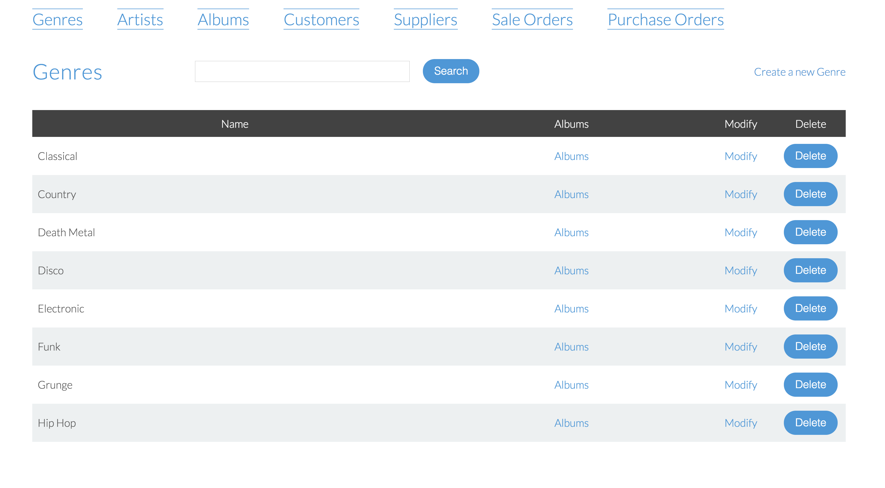

### CRUD operations on artists
- Artists can be searched by name.
- For each artist a link to filter his/her albums is provided.
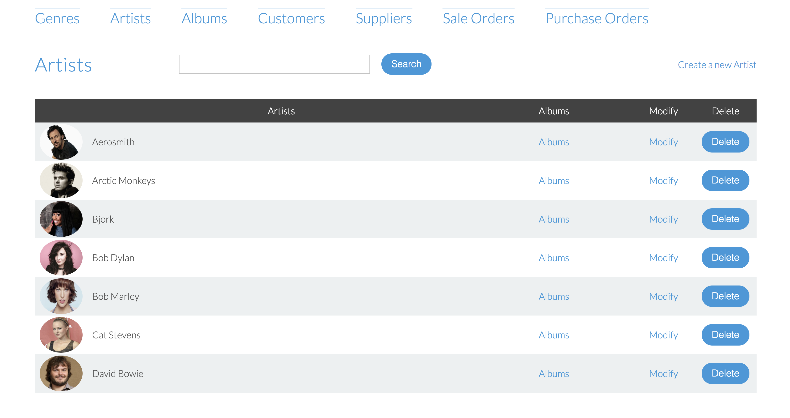

### CRUD operations on albums
- Albums can be searched by atist's name, title, genre and lstock level.
- Depending on their stock level settings, the current stock level of an album can be either displayed in green, yellow or red.
- For each album in stock, some links allow to reach :
  - The album profile
  - The artist profile
  

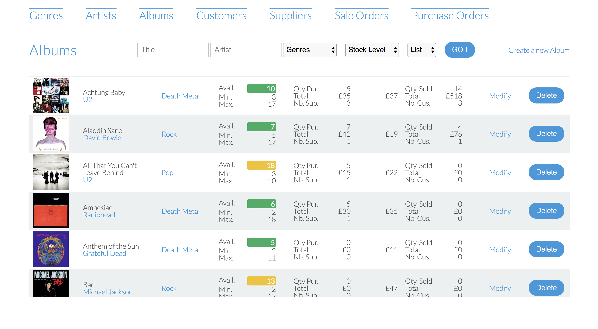
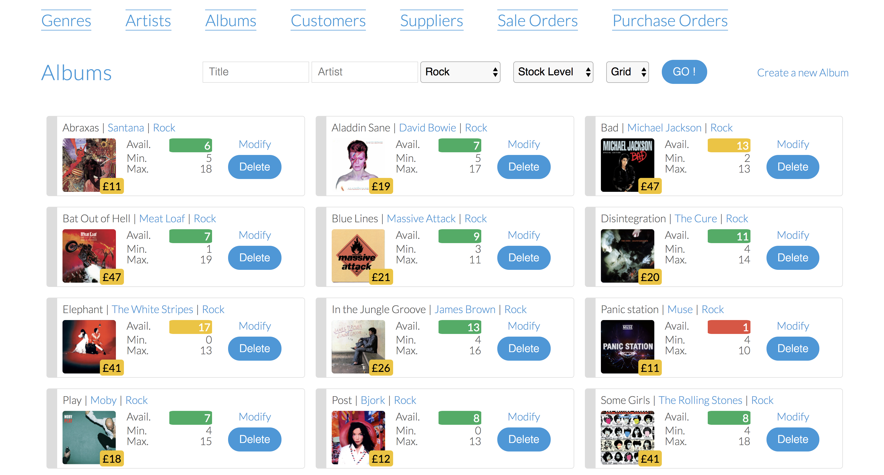
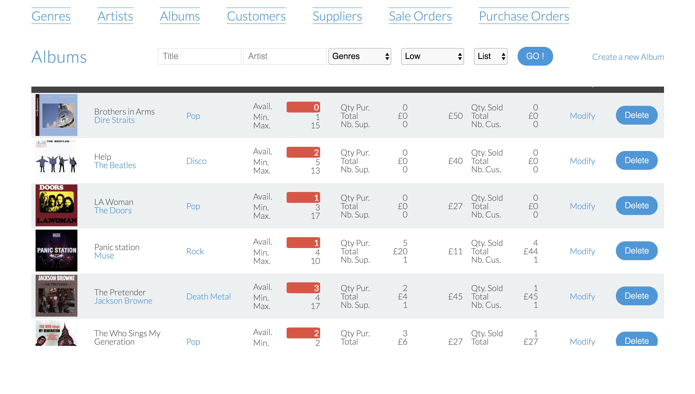
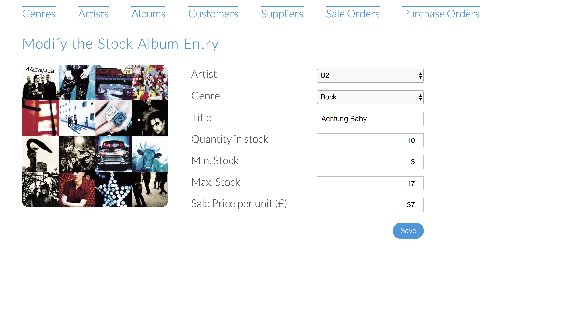

### CRUD operations on suppliers

### CRUD operations on customers
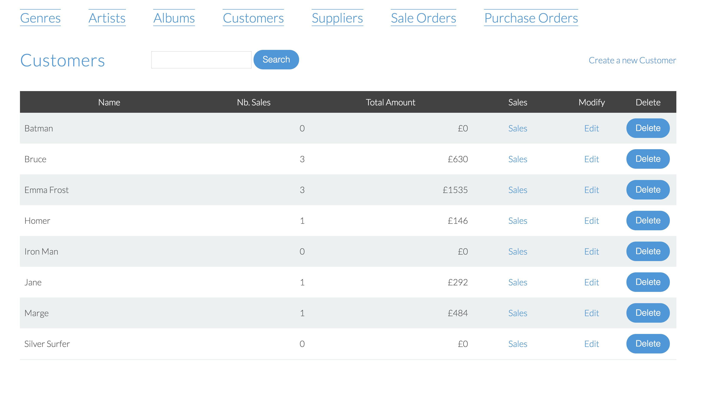

### CRUD operations on purchase orders
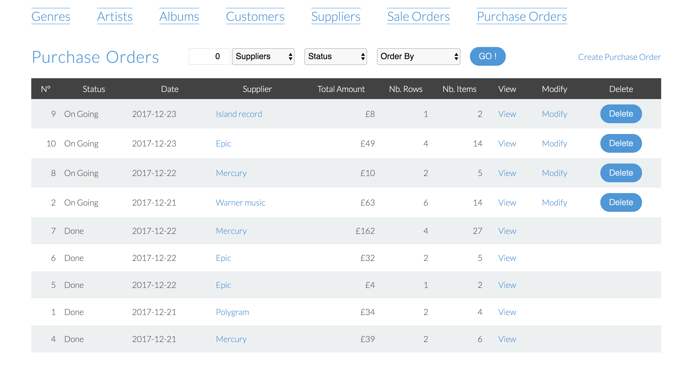
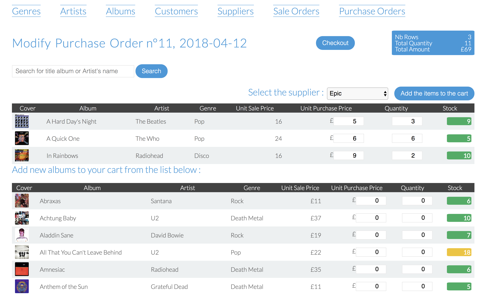

### CRUD operations on sale orders
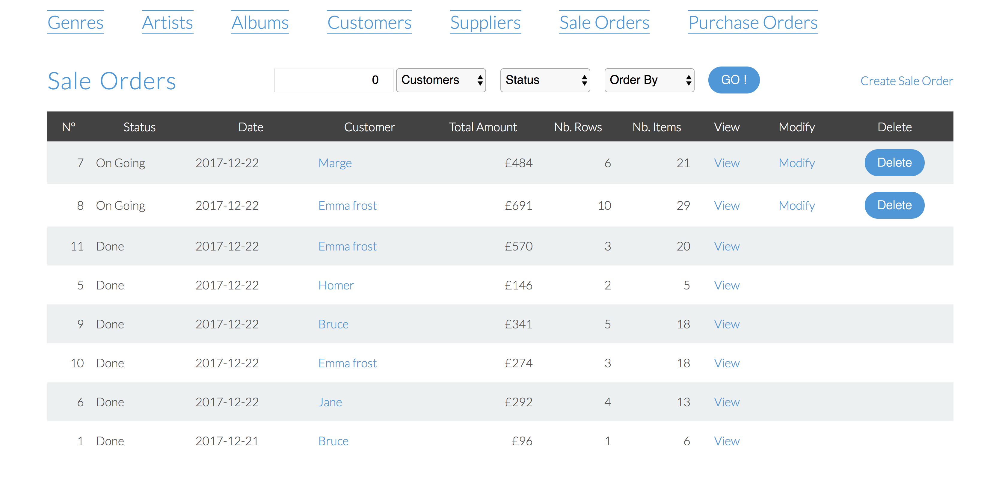
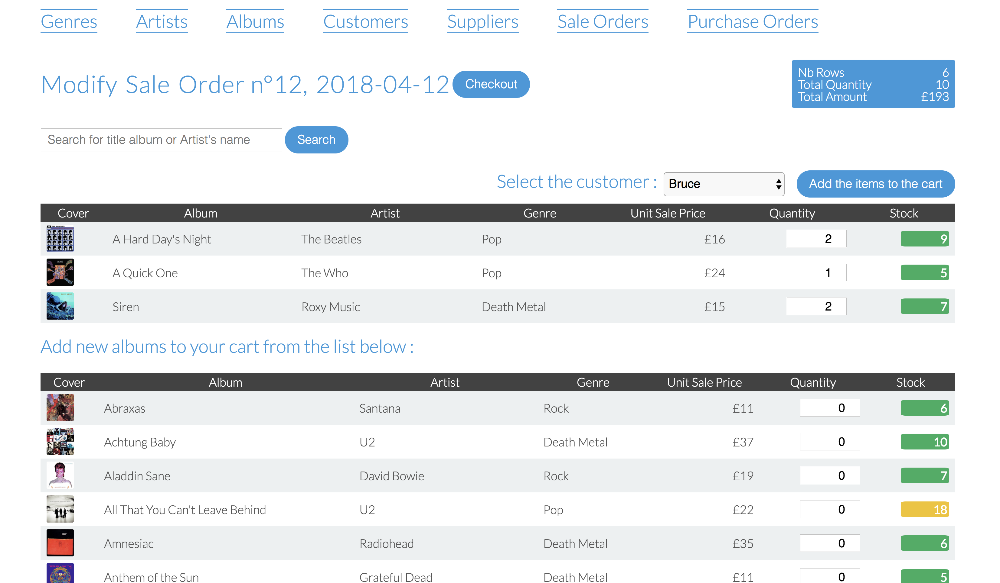
